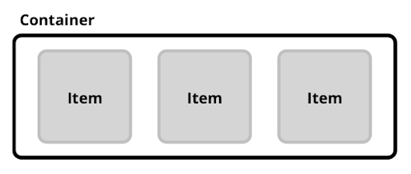

# Getting started with React Native

## Introduction

In this guide, we’ll take a closer look at [React Native](https://reactnative.dev). You’ll learn the absolute basics of getting started with it. Specifically, we’ll cover

- What React Native is
-	Simple Layout
-	Callback functions
-	Listeners
-	Navigation with different screens

This guide assumes that you’re coming from a web development background. If you have yet to install React Native, take a look at this link: https://reactnative.dev/docs/environment-setup 

<!-- ```bash
pip install foobar
``` -->

## What is React Native?
**React Native** allows you to build mobile applications that look, feel and perform much more like native applications. React Native is a framework for building apps that work on both Android and iOS. It allows you to create real native apps using JavaScript/TypeScript and React.

## Simple Layout
In this section, you are going to receive the basics in order to start building your first React Native app. In order to do so, you need to know what components are. In this guide we will take a look at the components **View, SafeAreaView** and **Scrollview**. They are styled with **Flexbox**. To customize a component **StyleSheet** can be imported and used from React Native.

### View
The [View](https://reactnative.dev/docs/view)-component is a fundamental component in React Native for building a user interface. It is a container that supports layout with flexbox, style, touch handling, and accessibility controls. It is equivalent to div-elements in HTML-code. View is designed to contain several components, as well as other Views. The following example creates a View that wraps two boxes with color and a text component in a row with padding. 

```javascript
import React from "react";
import { View, Text } from "react-native";

const ViewBoxes = () => {
  return (
    <View
      style={{
        flexDirection: "row",
        height: 100,
        padding: 20
      }}
    >
      <View style={{ backgroundColor: "blue", flex: 0.3 }} />
      <View style={{ backgroundColor: "red", flex: 0.5 }} />
      <Text>Hello World!</Text>
    </View>
  );
};

export default ViewBoxes;
```

There are different types of Views as well, as is described in the two following sections below.

### SafeAreaView
[SafeAreaView](https://reactnative.dev/docs/safeareaview) is a type of View, which restricts the view to areas that are safe to display items in. The purpose of SafeAreaView is to render content within the safe area boundaries of a device. For example, this means that the top part of the device, where the time and battery are, likely will be excluded from SafeAreaView.

### ScrollView
[ScrollView](https://reactnative.dev/docs/scrollview) is also a type of View, which enables scrolling. Keep in mind that ScrollViews must have a bounded height in order to work, since they contain unbounded-height children into a bounded container (via a scroll interaction). If a number of items too large for the height are put in the view, a scrollable view will display the elements. The user will be able to scroll on the device and view items. In order to bound the expandable height of a ScrollView, either set the height of the view directly, which is discouraged, or make sure all parent views have bounded height.

### Flexbox
To accommodate different screen sizes, React Native offers [Flexbox](https://reactnative.dev/docs/flexbox) support. A component, such as View, can specify the layout of its children using Flexbox. Flexbox is designed to provide a consistent layout on different screen sizes. A simple Flexbox has two elements, a container and items. A flex item is a child element to the flex container (as can be seen in the following figure). You will normally use a combination of flexDirection, alignItems, and justifyContent to achieve the right layout.



The use of flexDirection determines the direction of items. To change the direction you can simply write the following:

```css
container: {
  flexDirection: 'row/column'
}
```

justifyContent describes how to align children within the main axis of their container. For example, you can use this property to center a child horizontally within a container with flexDirection set to row or vertically with flexDirection set to column. You can see an example below:

```css
container: {
  justifyContent: 'flex-start/flex-end/space-between/space-around/space-evenly/center'
}
```

-	"flex-start" (default value) will align children of a container to the start of the main axis of the container.
-	"flex-end" will align children of a container to the end of the main axis of the container.
-	"center" will align children of a container in the center of the main axis of the container.
-	"space-between" will evenly space off children across the main axis of the container, distributing the remaining space between the children.
-	"space-around" is similar to space-between, but will result in space being distributed to beginning of the first child and end of the last child.
-	"space-evenly" will evenly distribute children within the alignment container along the main axis, and make the items have equal spacing between each other.

alignItems describes how to align children along the cross axis of the container. aligntItems is quite similar to justifyContent but instead of applying to the main axis, alignItems applies to the cross axis. 

```css
container: {
  alignItems: 'flex-start/flex-end/stretch/baseline/center'
}
```

Flexbox has many more attributes, which are good to know. However, the ones you have learned so far in this guide is sufficient enough to get started. If you want to learn more, please visit the website: https://flexboxfroggy.com/, a tool to play around with Flexbox.

### StyleSheet
There are several ways to style elements and components in React Native. To add styles inline in a component, the style property can be used. This would however be messy if a lot of styles are applied. To avoid this, one can use [StyleSheet](https://reactnative.dev/docs/stylesheet) for styling.

The example given below applies StyleSheet to the Text-component. At the bottom of the code the style is specified with different attributes, much like CSS.

```javascript
import React from "react";
import { StyleSheet, Text, View } from "react-native";

const App = () => (
  <View style={styles.container}>
    <Text style={styles.title}>React Native</Text>
  </View>
);

const styles = StyleSheet.create({
  container: {
    flex: 1,
    padding: 24,
    backgroundColor: "#eaeaea"
  },
  title: {
    marginTop: 16,
    paddingVertical: 8,
    borderWidth: 4,
    borderColor: "#20232a",
    borderRadius: 6,
    backgroundColor: "#61dafb",
    color: "#20232a",
    textAlign: "center",
    fontSize: 30,
    fontWeight: "bold"
  }
});

export default App;
```

### Callback functions
Callbacks are functions passed to other functions, and then called once that function is complete. They can be called with or without arguments, and are a very useful construct - especially in an asynchronous environment. This is similar to other programming languages where a function handle is passed into a function as an argument. An example can be seen below:

```javascript
const doSomething = (index, done) => {
  console.log(`Processing step ${index}`);
  done();
}

const finalize = () => {
  console.log('Done!');
}

doSomething(1, finalize);
```

### Listeners
Listeners are a common part of JavaScript/TypeScript, where a listener is added to listen to a change of state of the element it is connected to. If you’re using React hooks in a component with an event listener, your event listener callback cannot access the latest state. useRef can be incorporated to solve this problem. In the following simple example, we are listening to changes to the state of our modal:

```javascript
import React from 'react';
import Button from 'react-native';

class Modal extends React.Component {
  constructor(props) {
    super(props);
    this.state = {isModalOpen: true};

    this.handleClick = this.handleClick.bind(this);
  }

  handleClick() {
    this.setState(state => ({
      isModalOpen: !state.isModalOpen
    }));
  }

  render() {
    return (
      <Button onClick={this.handleClick}>
        {this.state.isModalOpen ? true : false}
      </Button>
    );
  }
}
```
In this example, we are keeping track of the state of our modal, whether it is open or not. In JavaScript, class methods are not bound by default. Therefore, you must bind `this.handleClick` to pass it to onClick, otherwise it will be undefined when the function is called. This can be seen in the example above.

In order to change the state of the modal, and call the handleClick-function, a button (or a similar component) must be included. In the above example the button has an onClick-event, which will change the state of the modal when its pressed.

This is a simple example with listeners in React Native. There is however many more ways to solve this problem.

### Navigation between screens
Managing the presentation of multiple screens is typically handled by what is known as a navigator. In this guide we will be using [React Navigation](https://reactnative.dev/docs/navigation). React Navigation provides a navigation solution, with the ability to present common stack navigation and tabbed navigation patterns on both Android and iOS.

First you need to complete the installation and setup:

```bash
npm install @react-navigation/native @react-navigation/stack
```

If you have a bare React Native project, install the dependencies with npm:

```bash
npm install @react-native-reanimated react-native-gesture-handler react-native-screens react-native-safe-area-context @react-native-community/masked-view
```
To finalize installation of `react-native-gesture-handler`, you need to add the following at the top of the file:

```javascript
import 'react-native-gesture-handler';
```

Now the app must be wrapped in a **NavigationContainer**. This is usually done in the entry file, such as App.js or index.js. An example is shown below:

```javascript
import 'react-native-gesture-handler';
import * as React from 'react';
import { NavigationContainer } from '@react-navigation/native';

const App = () => {
  return (
    <NavigationContainer>
      {/* Rest of your app code */}
    </NavigationContainer>
  );
};

export default App;
```

An app with different screens can now be created. An example of usage is given below, where a home screen has been created as well as a profile page:

```javascript
import * as React from 'react';
import { NavigationContainer } from '@react-navigation/native';
import { createStackNavigator } from '@react-navigation/stack';

const Stack = createStackNavigator();

const MyStack = () => {
  return (
    <NavigationContainer>
      <Stack.Navigator>
        <Stack.Screen
          name="Home"
          component={HomeScreen}
          options={{ title: 'Welcome' }}
        />
        <Stack.Screen name="Profile" component={ProfileScreen} />
      </Stack.Navigator>
    </NavigationContainer>
  );
};
```

Here, two different screens have been specified: **Home** and **Profile**. You can also pass other variables to a screen, such as `title: ‘Welcome’` seen in this example. To navigate to another screen from a screen you can write as the following:

```js
const HomeScreen = ({ navigation }) => {
  return (
    <Button
      title="Go to Iris's profile"
      onPress={() =>
        navigation.navigate('Profile', { name: 'Iris' })
      }
    />
  );
};
const ProfileScreen = ({ navigation, route }) => {
  return <Text>This is {route.params.name}'s profile</Text>;
};
```

where `navigation.navigate()` is used to navigate to a specific given page. In this example, first the page is specified, then `name: ‘Iris’`, which will be passed to ProfileScreen. It can then be accessed with `route.params.name`.

&nbsp;


## Congratulations
You have now completed the “Getting started with React Native”-guide! To find more information and expand your knowledge, visit: https://reactnative.dev/ 

&nbsp;


